### Installing Postgres

First, install Postgres for your OS if you haven't already done so.

On Debian/Ubuntu/WSL you can run `apt install postgresql`, for other distros or operating systems, you can download it from [here](https://www.postgresql.org/download/).

You should now have access to the `psql` CLI tool, and you can verify that the postgresql service is running with `systemctl status postgresql`.


### Enable Password Authentication

Edit the `pg_hba.conf` file to use `md5` authentication

```bash
sudo nano /etc/postgresql/<version>/main/pg_hba.conf
```
	
And make the following edit:

```diff
- local   all             postgres                                peer
+ local   all             postgres                                md5
```

Also, don't forget to ensure `md5` is set for any `host` entries:

```
host    all             all             127.0.0.1/32            md5
host    all             all             ::1/128                 md5
```

Then restart Postgres

```bash
sudo systemctl restart postgresql
```

And finally, set a (secure) password for the postgres user

```
sudo -u postgres psql -c "\password postgres"
```


---

## Schema

```mermaid
classDiagram
  class users {
    uuid id
    text email
    timestamp created_at
    timestamp updated_at
  }

  class domains {
    uuid id
    uuid user_id
    text domain_name
    date expiry_date
    text notes
    timestamp created_at
    timestamp updated_at
    uuid registrar_id
    timestamp registration_date
    timestamp updated_date
  }

  class registrars {
    uuid id
    text name
    text url
    uuid user_id
  }

  class tags {
    uuid id
    text name
    text color
    text description
    text icon
    uuid user_id
  }

  class domain_tags {
    uuid domain_id
    uuid tag_id
  }

  class notifications {
    uuid id
    uuid user_id
    uuid domain_id
    text change_type
    text message
    boolean sent
    boolean read
    timestamp created_at
  }

  class billing {
    uuid id
    uuid user_id
    text current_plan
    timestamp next_payment_due
    text billing_method
    timestamp created_at
    timestamp updated_at
    jsonb meta
  }

  class dns_records {
    uuid id
    uuid domain_id
    text record_type
    text record_value
    timestamp created_at
    timestamp updated_at
  }

  class domain_costings {
    uuid id
    uuid domain_id
    numeric purchase_price
    numeric current_value
    numeric renewal_cost
    boolean auto_renew
    timestamp created_at
    timestamp updated_at
  }

  class domain_hosts {
    uuid domain_id
    uuid host_id
  }

  class domain_links {
    uuid id
    uuid domain_id
    text link_name
    text link_url
    timestamp created_at
    timestamp updated_at
    text link_description
  }

  class domain_statuses {
    uuid id
    uuid domain_id
    text status_code
    timestamp created_at
  }

  class domain_updates {
    uuid id
    uuid domain_id
    uuid user_id
    text change
    text change_type
    text old_value
    text new_value
    timestamp date
  }

  class uptime {
    uuid id
    uuid domain_id
    timestamp checked_at
    boolean is_up
    integer response_code
    numeric response_time_ms
    numeric dns_lookup_time_ms
    numeric ssl_handshake_time_ms
    timestamp created_at
  }

  class ssl_certificates {
    uuid id
    uuid domain_id
    text issuer
    text issuer_country
    text subject
    date valid_from
    date valid_to
    text fingerprint
    integer key_size
    text signature_algorithm
    timestamp created_at
    timestamp updated_at
  }

  class whois_info {
    uuid id
    uuid domain_id
    text country
    text state
    text name
    text organization
    text street
    text city
    text postal_code
  }

  class user_info {
    uuid id
    uuid user_id
    jsonb notification_channels
    timestamp created_at
    timestamp updated_at
    text current_plan
  }

  class hosts {
    uuid id
    inet ip
    numeric lat
    numeric lon
    text isp
    text org
    text as_number
    text city
    text region
    text country
    uuid user_id
  }

  class ip_addresses {
    uuid id
    uuid domain_id
    inet ip_address
    boolean is_ipv6
    timestamp created_at
    timestamp updated_at
  }

  class notification_preferences {
    uuid id
    uuid domain_id
    text notification_type
    boolean is_enabled
    timestamp created_at
    timestamp updated_at
  }

  class sub_domains {
    uuid id
    uuid domain_id
    text name
    timestamp created_at
    timestamp updated_at
    jsonb sd_info
  }

  users --> domains : user_id
  registrars --> domains : registrar_id
  users --> registrars : user_id
  users --> tags : user_id
  domains --> domain_tags : domain_id
  tags --> domain_tags : tag_id
  users --> notifications : user_id
  domains --> notifications : domain_id
  users --> billing : user_id
  domains --> dns_records : domain_id
  domains --> domain_costings : domain_id
  domains --> domain_hosts : domain_id
  hosts --> domain_hosts : host_id
  domains --> domain_links : domain_id
  domains --> domain_statuses : domain_id
  domains --> domain_updates : domain_id
  users --> domain_updates : user_id
  domains --> uptime : domain_id
  domains --> ssl_certificates : domain_id
  domains --> whois_info : domain_id
  users --> user_info : user_id
  users --> hosts : user_id
  domains --> ip_addresses : domain_id
  domains --> notification_preferences : domain_id
  domains --> sub_domains : domain_id
```


